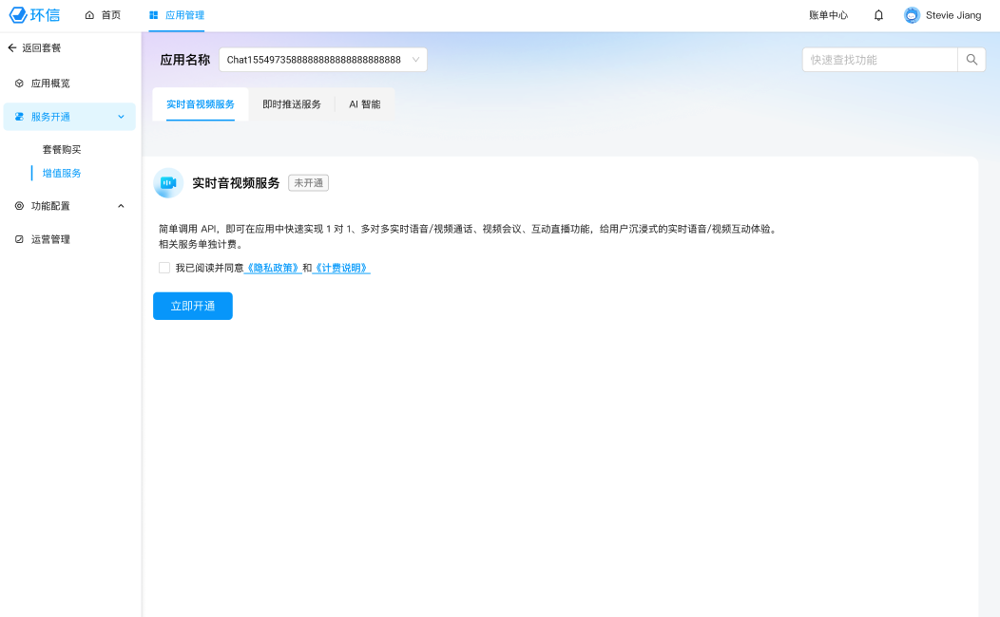
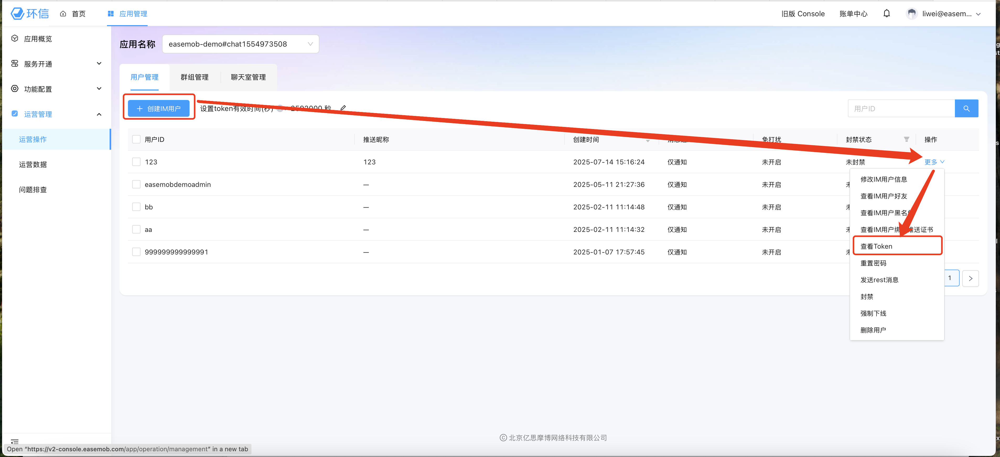
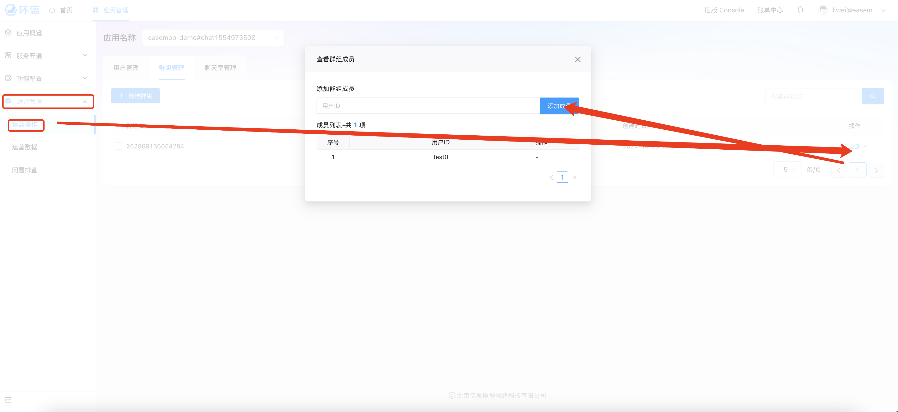
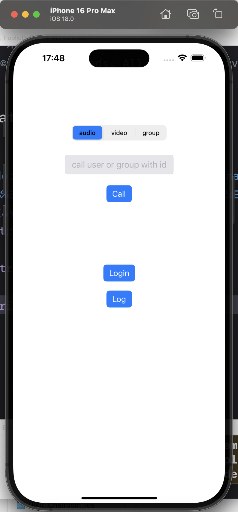
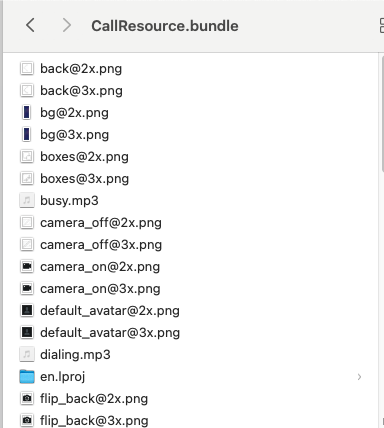

# EaseCallUIKit for iOS

本指南将介绍环信新EaseCallUIKit（V4.16.0）。新EaseCallUIKit致力于为开发者提供高效集成、功能全面、设计美观的通话场景，轻松满足即时通信呼叫绝大多数场景。请下载示例进行体验。

# 示例Demo

在本项目中，“Example”文件夹中有一个最佳实践演示项目，供您构建自己的业务能力。

如需体验EaseCallUIKit的完整功能（包含LiveCommunicationKit&Picture In Picture），您可以扫描以下二维码试用demo。


# CallKit 指南

## 简介

本指南介绍了 EaseCallUIKit 框架在 iOS 开发中的概述和使用示例
- EaseCallUIKit支持的通话类型（音频通话、视频通话、群组通话）必须与环信IM SDK（登录初始化）一起使用

## 目录

- [示例Demo](#示例demo)
- [开发环境](#开发环境)
- [安装](#安装)
  - [CocoaPods](#cocoapods)
- [结构](#结构)
- [运行示例项目](#运行示例项目)
- [快速开始](#快速开始)
  - [第一步：初始化EaseCallUIKit](#第一步初始化easecalluikit)
  - [第二步：登录IM SDK](#第2步登录im-sdk)
  - [第三步：粘贴代码后运行](#第三步粘贴代码后运行)
- [集成文档](#集成文档)
  - [1.初始化EaseCallUIKit（进阶）](#1初始化easecalluikit)
  - [2.登录](#2登录)
  - [3.监听事件和错误](#3监听easecalluikit事件和错误)   
  - [4.创建呼叫页面并调用呼叫Api](#4创建呼叫页面并调用呼叫api) 
  - [5.进阶用法](#5进阶用法)
- [常见问题](#常见问题)
- [自定义](#自定义)
  - [1.修改UI可配置项](#1修改ui可配置项)
  - [2.修改原有资源](#2修改原有资源)
  - [3.修改业务可配置项](#3修改业务可配置项)
  - [4.如果想进一步修改业务逻辑，请源码集成后修改](#4如果想进一步修改业务逻辑请源码集成后修改)
- [API概览](#api概览)
- [文档](#文档)
- [信令设计](#信令设计)
- [设计指南](#设计指南)
- [贡献](#贡献)
- [许可证](#许可证)
- [更新日志](#更新日志)

# 开发环境

- Xcode 16.0及以上版本 
- 最低支持系统：iOS 15.0
- 请确保您的项目已设置有效的开发者签名
- cocoapods v1.14.3 above

# 安装

您可以使用 CocoaPods 安装 EaseCallUIKit 作为 Xcode 项目的依赖项。

## CocoaPods

在podfile中添加如下依赖

```ruby
source 'https://github.com/CocoaPods/Specs.git'
platform :ios, '14.0'

target 'YourTarget' do
  use_frameworks!

  pod 'EaseCallUIKit'
end

post_install do |installer|
  installer.pods_project.targets.each do |target|
    target.build_configurations.each do |config|
      config.build_settings['IPHONEOS_DEPLOYMENT_TARGET'] = '14.0'
      config.build_settings["EXCLUDED_ARCHS[sdk=iphonesimulator*]"] = "arm64"
    end
  end
end
```

然后cd到终端下podfile所在文件夹目录执行

```
    pod install
```

>⚠️Xcode15编译报错 ```Sandbox: rsync.samba(47334) deny(1) file-write-create...```

> 解决方法: Build Setting里搜索 ```ENABLE_USER_SCRIPT_SANDBOXING```把```User Script Sandboxing```改为```NO```

> 如果`pod install`失败报错 RuntimeError - `PBXGroup` attempted to initialize an object with unknown ISA `PBXFileSystemSynchronizedRootGroup` from attributes: `{"isa"=>"PBXFileSystemSynchronizedRootGroup"`，请尝试升级pod版本为1.14.3
 Xcode16及其以下版本打开会报错 `Adjust the project format using a compatible version of Xcode to allow it to be opened by this version of Xcode.`

# 结构

### EaseCallUIKit 基本项目结构

```
Classes
├─ CoreService // 核心协议层以及定义。
│ ├─ Provider //EaseCallUIKit 用户信息获取缓存等。
│ ├─ Service // 业务协议。
│ │ ├─ `CallMessageService` // 呼叫api以及部分回调，以及常量枚举定义。
│ └─ Implements // 上面对应协议的实现组件。核心`CallKitManager`实现，分别为扩展处理`CallKitManager+Signaling.swift`、`CallKitManager+RTC.swift`等
├─ Resource // 图像或本地化文件。
├─ Commons
       ├─ Utils // 一些CallKitManager用到的工具类（AudioPlayerManager、LiveCommunicationManager、GlobalTimerManager）以及相关UI类。
       ├─ Appearance // UI以及资源配置相关。
       ├─ ConsoleLog // 日志打印相关。
       ├─ Theme // 主题相关组件，包括颜色、字体、换肤协议及其组件。
       └─ Extension // 一些方便的系统类扩展。
│
└─ UI // 基本UI组件，不带业务。
    ├─ Controllers // 视图控制器。
    ├─ Views // 所有UIView。
    └─ Cells // 所有UITableViewCell。
```
Provider文件夹中包含`CallProfileProtocol.swift`用户信息协议以及`Providers.swift`信息提供者协议
Services文件夹中包含`CallError.swift`错误信息以及`CallMessageService.swift`呼叫API协议以及回调方法跟结束原因枚举等。
Commons文件夹中包含一些工具类、UI配置类、主题类等。一些CallKitManager用到的工具类（AudioPlayerManager、LiveCommunicationManager、GlobalTimerManager）
UI文件夹中包含所有UI组件，包括视图控制器、UIView、UITableViewCell等。
# 运行示例项目

## 前提条件

- 登录 [环信控制台]

- [注册环信AppKey](https://docs-im-beta.easemob.com/product/enable_and_configure_IM.html#%E8%8E%B7%E5%8F%96%E7%8E%AF%E4%BF%A1%E5%8D%B3%E6%97%B6%E9%80%9A%E8%AE%AF-im-%E7%9A%84%E4%BF%A1%E6%81%AF)

- 开通RTC功能  

- [创建IM用户并获取token](https://v2-console.easemob.com/app/operation/management/micro/app/im-service/operative-service/user),这里建议创建两个用户。

- 在`PublicDefines.swift` 中找到
```Swift
let AppKey: String = <#AppKey#>
```
- 将注册的AppKey填入其中。
- 在终端cd到podfile所在的文件目录，复制代理到终端，执行`pod install`命令，等待成功后点击运行即可。
- 将用户名以及token复制粘贴填写在输入框中->然后点击登录->选择呼叫类型->输入呼叫用户的userId->点击呼叫。
- 若需发起群组通话，才需要[创建群组](https://v2-console.easemob.com/app/operation/management/micro/app/im-service/operative-service/group)，将已创建用户加入群组见下图，让其中一两个用户登录后，将群组id复制到输入框中点击呼叫即可。





注意： 如果想要自定义的头像昵称显示信息，在ViewController.swift中找到loginAction方法后填入您要显示的当前用户id对应的昵称头像`profile.nickname` `profile.avatarURL`信息即可
注意：
   在生产环境中，为了安全考虑，你需要在你的应用服务器集成 获取 App Token API 和 获取用户 Token API 实现获取 Token 的业务逻辑，使你的用户从你的应用服务器获取 Token。


# 快速开始

本指南提供了不同 EaseCallUIKit 组件的多个使用示例。 请参阅“示例”文件夹以获取显示各种用例的详细代码片段和项目。
## 前提条件

- 登录 [环信控制台]

- [注册环信AppKey](https://docs-im-beta.easemob.com/product/enable_and_configure_IM.html#%E8%8E%B7%E5%8F%96%E7%8E%AF%E4%BF%A1%E5%8D%B3%E6%97%B6%E9%80%9A%E8%AE%AF-im-%E7%9A%84%E4%BF%A1%E6%81%AF)

- 开通RTC功能  

- [创建IM用户并获取token](https://v2-console.easemob.com/app/operation/management/micro/app/im-service/operative-service/user),这里建议创建两个用户。

注意：
   在生产环境中，为了安全考虑，你需要在你的应用服务器集成 获取 App Token API 和 获取用户 Token API 实现获取 Token 的业务逻辑，使你的用户从你的应用服务器获取 Token。

参考以下步骤在 Xcode 中创建一个 iOS 平台下的App，创建设置如下：

* Product Name 填入EaseCallUIKitQuickStart。
* Organization Identifier 设为 您的identifier。
* User Interface 选择 Storyboard。
* Language 选择 你的常用开发语言。
* 添加权限 在项目 `info.plist` 中添加相关权限：

Add related privileges in the `info.plist` project:

```
Privacy - Photo Library Usage Description //相册权限    Album privileges.
Privacy - Microphone Usage Description //麦克风权限     Microphone privileges.
Privacy - Camera Usage Description //相机权限    Camera privileges.
```

- 如要配置画中画，[PictureInPicture.md](./PictureInPicture.md)。
- 如要配置LiveCommunicationKit，[LiveCommunicationKit.md](./LiveCommunicationKit.md)。

### 第一步：初始化EaseCallUIKit

```Swift
import EaseCallUIKit

@UIApplicationMain
class AppDelegate：UIResponder，UIApplicationDelegate {

     var window: UIWindow？

     func application(_ application: UIApplication, didFinishLaunchingWithOptions launchOptions: [UIApplicationLaunchOptionsKey: Any]?) -> Bool {
        let option = ChatSDKOptions(appkey: "your app key")//首先需要初始化SDK
        option.enableConsoleLog = true//开启日志
        option.isAutoLogin = false//此处只是示例项目，真实使用时参考环信Demo源码，自动登录更方便
        ChatClient.shared().initializeSDK(with: option)//初始化SDK
        CallKitManager.shared.setup()//初始化EaseCallUIKit
     }
}
```

### 第2步：登录IM SDK

``` Swift
        ChatClient.shared().login(withUsername: userId, token: token) { [weak self] userId,error  in
            if let error = error {
                self?.showCallToast(toast: "Login failed: \(error.errorDescription ?? "")")
            } else {
                self?.showCallToast(toast: "Login successful")
                self?.userIdField.isHidden = true
                self?.tokenField.isHidden = true
                self?.loginButton.isHidden = true 
            }
        }
```

### 第三步：粘贴代码后运行

- 找到项目中Main.storyboard然后右键菜单，Open As->Source Code,复制下列代码替换并
``` XML
<?xml version="1.0" encoding="UTF-8"?>
<document type="com.apple.InterfaceBuilder3.CocoaTouch.Storyboard.XIB" version="3.0" toolsVersion="23504" targetRuntime="iOS.CocoaTouch" propertyAccessControl="none" useAutolayout="YES" useTraitCollections="YES" colorMatched="YES" initialViewController="vXZ-lx-hvc">
    <device id="retina4_7" orientation="portrait" appearance="light"/>
    <dependencies>
        <deployment identifier="iOS"/>
        <plugIn identifier="com.apple.InterfaceBuilder.IBCocoaTouchPlugin" version="23506"/>
        <capability name="System colors in document resources" minToolsVersion="11.0"/>
        <capability name="documents saved in the Xcode 8 format" minToolsVersion="8.0"/>
    </dependencies>
    <scenes>
        <!--View Controller-->
        <scene sceneID="ufC-wZ-h7g">
            <objects>
                <viewController id="vXZ-lx-hvc" customClass="ViewController" customModule="EaseCallUIKitQuickStart" customModuleProvider="target" sceneMemberID="viewController">
                    <layoutGuides>
                        <viewControllerLayoutGuide type="top" id="jyV-Pf-zRb"/>
                        <viewControllerLayoutGuide type="bottom" id="2fi-mo-0CV"/>
                    </layoutGuides>
                    <view key="view" contentMode="scaleToFill" id="kh9-bI-dsS">
                        <rect key="frame" x="0.0" y="0.0" width="375" height="667"/>
                        <autoresizingMask key="autoresizingMask" flexibleMaxX="YES" flexibleMaxY="YES"/>
                        <subviews>
                            <textField opaque="NO" contentMode="scaleToFill" horizontalHuggingPriority="248" contentHorizontalAlignment="left" contentVerticalAlignment="center" borderStyle="roundedRect" placeholder="call user or group with id" textAlignment="center" minimumFontSize="17" translatesAutoresizingMaskIntoConstraints="NO" id="laE-OW-CWK">
                                <rect key="frame" x="75" y="191" width="225" height="40"/>
                                <color key="backgroundColor" systemColor="systemGray5Color"/>
                                <constraints>
                                    <constraint firstAttribute="height" constant="40" id="kOp-K7-HeC"/>
                                </constraints>
                                <color key="textColor" white="0.0" alpha="1" colorSpace="custom" customColorSpace="genericGamma22GrayColorSpace"/>
                                <fontDescription key="fontDescription" type="system" pointSize="18"/>
                                <textInputTraits key="textInputTraits"/>
                            </textField>
                            <button opaque="NO" contentMode="scaleToFill" contentHorizontalAlignment="center" contentVerticalAlignment="center" buttonType="system" lineBreakMode="middleTruncation" translatesAutoresizingMaskIntoConstraints="NO" id="zid-qi-Z7H">
                                <rect key="frame" x="161.5" y="254" width="52.5" height="35"/>
                                <constraints>
                                    <constraint firstAttribute="height" constant="35" id="Qdf-ZL-nrv"/>
                                </constraints>
                                <state key="normal" title="Button"/>
                                <buttonConfiguration key="configuration" style="filled" title="Call"/>
                                <connections>
                                    <action selector="callAction:" destination="vXZ-lx-hvc" eventType="touchUpInside" id="21A-e9-7bB"/>
                                </connections>
                            </button>
                            <textField opaque="NO" contentMode="scaleToFill" horizontalHuggingPriority="248" contentHorizontalAlignment="left" contentVerticalAlignment="center" borderStyle="roundedRect" placeholder="login user id" textAlignment="center" minimumFontSize="17" translatesAutoresizingMaskIntoConstraints="NO" id="hM6-uK-yyP">
                                <rect key="frame" x="139" y="316" width="97" height="34"/>
                                <color key="backgroundColor" systemColor="systemGray5Color"/>
                                <constraints>
                                    <constraint firstAttribute="height" constant="34" id="L6Z-yu-oNG"/>
                                    <constraint firstAttribute="width" constant="97" id="mfC-xf-iFf"/>
                                </constraints>
                                <fontDescription key="fontDescription" type="system" pointSize="14"/>
                                <textInputTraits key="textInputTraits"/>
                            </textField>
                            <textField opaque="NO" contentMode="scaleToFill" horizontalHuggingPriority="248" contentHorizontalAlignment="left" contentVerticalAlignment="center" borderStyle="roundedRect" placeholder="token" textAlignment="center" minimumFontSize="17" translatesAutoresizingMaskIntoConstraints="NO" id="9QV-P8-MOd">
                                <rect key="frame" x="155.5" y="377" width="64" height="34"/>
                                <color key="backgroundColor" systemColor="systemGray5Color"/>
                                <constraints>
                                    <constraint firstAttribute="height" constant="34" id="bLn-UW-UNZ"/>
                                </constraints>
                                <fontDescription key="fontDescription" type="system" pointSize="14"/>
                                <textInputTraits key="textInputTraits"/>
                            </textField>
                            <button opaque="NO" contentMode="scaleToFill" contentHorizontalAlignment="center" contentVerticalAlignment="center" buttonType="system" lineBreakMode="middleTruncation" translatesAutoresizingMaskIntoConstraints="NO" id="1TW-7c-QOv">
                                <rect key="frame" x="154.5" y="438" width="66" height="35"/>
                                <constraints>
                                    <constraint firstAttribute="height" constant="35" id="X5z-2c-9KQ"/>
                                </constraints>
                                <state key="normal" title="Button"/>
                                <buttonConfiguration key="configuration" style="filled" title="Login"/>
                                <connections>
                                    <action selector="loginAction:" destination="vXZ-lx-hvc" eventType="touchUpInside" id="D5E-pO-2Jw"/>
                                </connections>
                            </button>
                            <button opaque="NO" contentMode="scaleToFill" contentHorizontalAlignment="center" contentVerticalAlignment="center" buttonType="system" lineBreakMode="middleTruncation" translatesAutoresizingMaskIntoConstraints="NO" id="0Qd-2k-2aV">
                                <rect key="frame" x="161" y="497" width="53" height="35"/>
                                <constraints>
                                    <constraint firstAttribute="height" constant="35" id="fuc-9c-KcU"/>
                                    <constraint firstAttribute="width" constant="53" id="u4m-wu-cwy"/>
                                </constraints>
                                <state key="normal" title="Button"/>
                                <buttonConfiguration key="configuration" style="filled" title="Log"/>
                                <connections>
                                    <action selector="logAction:" destination="vXZ-lx-hvc" eventType="touchUpInside" id="QkB-ye-mNH"/>
                                </connections>
                            </button>
                            <segmentedControl opaque="NO" contentMode="scaleToFill" contentHorizontalAlignment="center" contentVerticalAlignment="top" segmentControlStyle="plain" selectedSegmentIndex="0" translatesAutoresizingMaskIntoConstraints="NO" id="KgU-kb-zgq">
                                <rect key="frame" x="89" y="129" width="197" height="32"/>
                                <constraints>
                                    <constraint firstAttribute="height" constant="31" id="49T-gN-YNX"/>
                                    <constraint firstAttribute="width" constant="197" id="64h-61-hN9"/>
                                </constraints>
                                <segments>
                                    <segment title="audio"/>
                                    <segment title="video"/>
                                    <segment title="group"/>
                                </segments>
                                <color key="tintColor" systemColor="systemBlueColor"/>
                                <connections>
                                    <action selector="chooseCallType:" destination="vXZ-lx-hvc" eventType="valueChanged" id="faD-YP-JKc"/>
                                </connections>
                            </segmentedControl>
                        </subviews>
                        <color key="backgroundColor" red="1" green="1" blue="1" alpha="1" colorSpace="custom" customColorSpace="sRGB"/>
                        <constraints>
                            <constraint firstItem="zid-qi-Z7H" firstAttribute="centerX" secondItem="kh9-bI-dsS" secondAttribute="centerX" id="3PV-gJ-xUs"/>
                            <constraint firstItem="zid-qi-Z7H" firstAttribute="top" secondItem="laE-OW-CWK" secondAttribute="bottom" constant="23" id="3d9-xN-rVV"/>
                            <constraint firstItem="KgU-kb-zgq" firstAttribute="top" secondItem="jyV-Pf-zRb" secondAttribute="bottom" constant="109" id="3iR-bE-dsH"/>
                            <constraint firstItem="1TW-7c-QOv" firstAttribute="centerX" secondItem="kh9-bI-dsS" secondAttribute="centerX" id="7qi-nX-Ep7"/>
                            <constraint firstItem="hM6-uK-yyP" firstAttribute="top" secondItem="zid-qi-Z7H" secondAttribute="bottom" constant="27" id="Fbk-dr-XJy"/>
                            <constraint firstItem="9QV-P8-MOd" firstAttribute="centerX" secondItem="kh9-bI-dsS" secondAttribute="centerX" id="NLK-X7-nmU"/>
                            <constraint firstItem="KgU-kb-zgq" firstAttribute="centerX" secondItem="kh9-bI-dsS" secondAttribute="centerX" id="PaT-sj-EOF"/>
                            <constraint firstItem="0Qd-2k-2aV" firstAttribute="centerX" secondItem="kh9-bI-dsS" secondAttribute="centerX" id="Ptx-cV-DpW"/>
                            <constraint firstItem="1TW-7c-QOv" firstAttribute="top" secondItem="9QV-P8-MOd" secondAttribute="bottom" constant="27" id="Vde-Gf-T6Q"/>
                            <constraint firstItem="laE-OW-CWK" firstAttribute="centerX" secondItem="kh9-bI-dsS" secondAttribute="centerX" id="ZDm-c5-ZIK"/>
                            <constraint firstItem="9QV-P8-MOd" firstAttribute="top" secondItem="hM6-uK-yyP" secondAttribute="bottom" constant="27" id="hag-4S-Gef"/>
                            <constraint firstItem="0Qd-2k-2aV" firstAttribute="top" secondItem="1TW-7c-QOv" secondAttribute="bottom" constant="24" id="r8t-en-w10"/>
                            <constraint firstItem="laE-OW-CWK" firstAttribute="top" secondItem="jyV-Pf-zRb" secondAttribute="bottom" constant="171" id="vBn-aQ-3Q3"/>
                            <constraint firstItem="hM6-uK-yyP" firstAttribute="centerX" secondItem="kh9-bI-dsS" secondAttribute="centerX" id="ztk-Cf-e76"/>
                        </constraints>
                    </view>
                    <connections>
                        <outlet property="callButton" destination="zid-qi-Z7H" id="Awl-9Z-oQR"/>
                        <outlet property="callTypeSegment" destination="KgU-kb-zgq" id="wvg-RC-nDZ"/>
                        <outlet property="inputField" destination="laE-OW-CWK" id="jPc-mR-gs4"/>
                        <outlet property="logButton" destination="0Qd-2k-2aV" id="7P1-p7-nd8"/>
                        <outlet property="loginButton" destination="1TW-7c-QOv" id="xVW-DO-dD2"/>
                        <outlet property="tokenField" destination="9QV-P8-MOd" id="rAN-5C-qu0"/>
                        <outlet property="userIdField" destination="hM6-uK-yyP" id="zV0-uW-JWD"/>
                    </connections>
                </viewController>
                <placeholder placeholderIdentifier="IBFirstResponder" id="x5A-6p-PRh" sceneMemberID="firstResponder"/>
            </objects>
            <point key="canvasLocation" x="13.6" y="-69.715142428785612"/>
        </scene>
    </scenes>
    <resources>
        <systemColor name="systemBlueColor">
            <color red="0.0" green="0.47843137250000001" blue="1" alpha="1" colorSpace="custom" customColorSpace="sRGB"/>
        </systemColor>
        <systemColor name="systemGray5Color">
            <color red="0.8980392157" green="0.8980392157" blue="0.91764705879999997" alpha="1" colorSpace="custom" customColorSpace="sRGB"/>
        </systemColor>
    </resources>
</document>

```

- 找到项目中的ViewController.swift，复制下列代码并替换
``` Swift
import UIKit
import EaseCallUIKit
import QuickLook

class ViewController: UIViewController {
    
    var callType: CallType = .singleAudio

    @IBOutlet var inputField: UITextField!
        
    @IBOutlet var callButton: UIButton!
    
    @IBOutlet weak var userIdField: UITextField!
    @IBOutlet weak var tokenField: UITextField!
    @IBOutlet weak var loginButton: UIButton!
    @IBOutlet weak var callTypeSegment: UISegmentedControl!
    @IBOutlet weak var logButton: UIButton!

    
    override func viewDidLoad() {
        super.viewDidLoad()
        // Do any additional setup after loading the view, typically from a nib.
//        CallKitManager.shared.currentUserInfo = CallUserProfile()
        self.callTypeSegment.selectedSegmentIndex = 0
        self.callTypeSegment.selectedSegmentTintColor = .systemBlue
        CallKitManager.shared.profileProvider = self
        CallKitManager.shared.addListener(self)
    }
    
    override func viewDidAppear(_ animated: Bool) {
        super.viewDidAppear(animated)
    }


    override func touchesBegan(_ touches: Set<UITouch>, with event: UIEvent?) {
        self.view.endEditing(true)
    }

    @IBAction func chooseCallType(_ sender: Any) {
        self.callType = CallType(rawValue: UInt(self.callTypeSegment.selectedSegmentIndex)) ?? .singleAudio
    }
    
    @IBAction func loginAction(_ sender: Any) {
        self.view.endEditing(true)
        guard let userId = userIdField.text, !userId.isEmpty,
              let token = tokenField.text, !token.isEmpty else {
            self.showCallToast(toast: "Please enter a valid username and token")
            return
        }
        
        ChatClient.shared().login(withUsername: userId, token: token) { [weak self] userId,error  in
            if let error = error {
                self?.showCallToast(toast: "Login failed: \(error.errorDescription ?? "")")
            } else {
                self?.showCallToast(toast: "Login successful")
                if !userId.isEmpty {
                    let profile = CallUserProfile()
                    profile.id = userId
                    profile.avatarURL = "https://xxxxx"
                    profile.nickname = "\(userId)昵称"
                    CallKitManager.shared.currentUserInfo = profile
                }
                self?.userIdField.isHidden = true
                self?.tokenField.isHidden = true
                self?.loginButton.isHidden = true 
            }
        }
    }
    
    @IBAction func logAction(_ sender: Any) {
        let previewController = QLPreviewController()
        previewController.dataSource = self
        self.present(previewController, animated: true)
    }
    
    @IBAction func callAction(_ sender: Any) {
        self.view.endEditing(true)
        guard let input = inputField.text?.trimmingCharacters(in: .whitespacesAndNewlines), !input.isEmpty else {
            self.showCallToast(toast: "Please enter a valid username or group id")
            return
        }
        if self.callType != .groupCall {
            CallKitManager.shared.call(with: input, type: self.callType)
        } else {
            CallKitManager.shared.groupCall(groupId: input)
        }
    }
}

extension ViewController: QLPreviewControllerDataSource {
    public func numberOfPreviewItems(in controller: QLPreviewController) -> Int {
        1
    }
    
    public func previewController(_ controller: QLPreviewController, previewItemAt index: Int) -> QLPreviewItem {
        let fileURL = URL(fileURLWithPath: NSHomeDirectory() + "/Library/Application Support/HyphenateSDK/easemobLog/easemob.log")
        return fileURL as QLPreviewItem
    }
    
    
}

```

然后点击运行即可.


# 集成文档

以下是进阶用法的部分示例。会话列表页面、消息列表页、联系人列表均可分开使用。

## 1.初始化EaseCallUIKit
相比于上面快速开始的EaseCallUIKit初始化这里多了ChatOptions的参数，主要是对SDK中是否打印log以及是否自动登录，是否默认使用用户属性的开关配置。ChatOptions即IMSDK的Option类，内中有诸多开关属性可参见环信官网IMSDK文档
```Swift
    //已经集成了环信IMSDK 即已经import HyphenateChat
    private func setupCallKit() {
        let options = EMOptions(appkey: appKey)
        #if DEBUG
        options.apnsCertName = "Your_APNS_Developer"
        options.pushKitCertName = "YourVoipDev"
        #else
        options.apnsCertName = "Your_APNS_Product"
        options.pushKitCertName = "YourVoipPro"
        #endif
        EMClient.shared().initializeSDK(with: options)
        //初始化环信CallKit
        let config = EaseCallUIKit.CallKitConfig()
        config.enableVOIP = true//开启voip功能后会自动开启LiveCommunicationKit，需要在develop.apple.com申请证书时勾选
        config.enablePIPOn1V1VideoScene = true//开启画中画，同时需要开启应用后台摄像头采集权限，详见[PictureInPicture.md](./PictureInPicture.md)。
        CallKitManager.shared.setup(config)
    }

    //没有集成环信IMSDK，只想使用CallKit
    private func setupCallKit() {
        let options = ChatSDKOptions(appkey: appKey)
        #if DEBUG
        options.apnsCertName = "Your_APNS_Developer"
        options.pushKitCertName = "YourVoipDev"
        #else
        options.apnsCertName = "Your_APNS_Product"
        options.pushKitCertName = "YourVoipPro"
        #endif
        ChatClient.shared().initializeSDK(with: options)
        //初始化环信CallKit
        let config = EaseCallUIKit.CallKitConfig()
        config.enableVOIP = true//开启voip功能后会自动开启LiveCommunicationKit，需要在develop.apple.com申请证书时勾选
        config.enablePIPOn1V1VideoScene = true//开启画中画，同时需要开启应用后台摄像头采集权限，详见[PictureInPicture.md](./PictureInPicture.md)。
        CallKitManager.shared.setup(config)
    }
    
```

## 2.登录

```Swift
            ChatClient.shared().login(withUsername: userId, token: token) { [weak self] userId,error  in
            if let error = error {
                self?.showCallToast(toast: "Login failed: \(error.errorDescription ?? "")")
            } else {
                self?.showCallToast(toast: "Login successful")
//if !userId.isEmpty { //如有需要透传头像昵称请打开
//    let profile = CallUserProfile()
//    profile.id = userId
//    profile.avatarURL = "https://xxxxx"
//    profile.nickname = "\(userId)昵称"
//    CallKitManager.shared.currentUserInfo = profile
//}
                self?.userIdField.isHidden = true
                self?.tokenField.isHidden = true
                self?.loginButton.isHidden = true 
            }
        }
// token生成参见快速开始中登录步骤中链接。
// 需要从您的应用服务器获取token。 您也可以使用控制台生成的临时Token登录。
// 在控制台生成用户和临时用户 token，请参见
// https://docs-im-beta.easemob.com/product/enable_and_configure_IM.html#%E5%88%9B%E5%BB%BA-im-%E7%94%A8%E6%88%B7。
```

## 3.监听EaseCallUIKit事件和错误

您可以调用下面方法来监听 EaseCallUIKit中用户相关状态变更的事件和错误。

```Swift        
        CallKitManager.shared.addListener(self)//添加监听，均为可选方法
```
下面是监听事件的示例代码。
```Swift 
extension MainViewController: CallServiceListener {
    
    func didOccurError(error: CallError) {
        DispatchQueue.main.async {
            self.showToast(toast: "Occur error:\(error.errorMessage) on module:\(error.module.rawValue)")
        }
        switch error { //Swift error handler
        case .im(.invalidURL):
            print("Invalid URL")
        case .rtc(.invalidToken):
            print("Invalid Token")
        case .business(.state):
            print("State error")
        case .business(.param):
            print("Param error")
        default:
            // 注意这里要通过 error.error.message 访问
            print("Other error: \(error.error.message)")
        }
//        switch error.module {//OC error handler
//        case .im:
//            switch error.getIMError() {
//            case .invalidURL:
//                print("")
//            default:
//                break
//            }
//        case .rtc:
//            switch error.getRTCError() {
//            case .invalidToken:
//                print("")
//            default:
//                break
//            }
//        case .business:
//            switch error.getCallBusinessError() {
//            case .state:
//                print("")
//            case .param:
//                print("")
//            case .signaling:
//                print("")
//            default:
//                break
//            }
//        default:
//            break
//        }
    }
        
    func didUpdateCallEndReason(reason: CallEndReason, info: CallInfo) {
        print("didUpdateCallEndReason: \(String(describing: info.inviteMessage?.ext))")
        if let messageId = info.inviteMessageId {
            NotificationCenter.default.post(name: Notification.Name("didUpdateCallEndReason"), object: messageId)
        }
        
    }
    
    func remoteUserDidJoined(userId: String, uid: UInt, channelName: String, type: CallType) {
        
    }
    
    func remoteUserDidLeft(userId: String, uid: UInt, channelName: String, type: CallType) {
        
    }
    
    func onRtcEngineCreated(engine: AgoraRtcEngineKit?) {
        
    }
    
}
```
## 4.创建呼叫页面并调用呼叫Api

- 找到项目中Main.storyboard然后右键菜单，Open As->Source Code,复制下列代码替换并
``` XML
<?xml version="1.0" encoding="UTF-8"?>
<document type="com.apple.InterfaceBuilder3.CocoaTouch.Storyboard.XIB" version="3.0" toolsVersion="23504" targetRuntime="iOS.CocoaTouch" propertyAccessControl="none" useAutolayout="YES" useTraitCollections="YES" colorMatched="YES" initialViewController="vXZ-lx-hvc">
    <device id="retina4_7" orientation="portrait" appearance="light"/>
    <dependencies>
        <deployment identifier="iOS"/>
        <plugIn identifier="com.apple.InterfaceBuilder.IBCocoaTouchPlugin" version="23506"/>
        <capability name="System colors in document resources" minToolsVersion="11.0"/>
        <capability name="documents saved in the Xcode 8 format" minToolsVersion="8.0"/>
    </dependencies>
    <scenes>
        <!--View Controller-->
        <scene sceneID="ufC-wZ-h7g">
            <objects>
                <viewController id="vXZ-lx-hvc" customClass="ViewController" customModule="EaseCallUIKitQuickStart" customModuleProvider="target" sceneMemberID="viewController">
                    <layoutGuides>
                        <viewControllerLayoutGuide type="top" id="jyV-Pf-zRb"/>
                        <viewControllerLayoutGuide type="bottom" id="2fi-mo-0CV"/>
                    </layoutGuides>
                    <view key="view" contentMode="scaleToFill" id="kh9-bI-dsS">
                        <rect key="frame" x="0.0" y="0.0" width="375" height="667"/>
                        <autoresizingMask key="autoresizingMask" flexibleMaxX="YES" flexibleMaxY="YES"/>
                        <subviews>
                            <textField opaque="NO" contentMode="scaleToFill" horizontalHuggingPriority="248" contentHorizontalAlignment="left" contentVerticalAlignment="center" borderStyle="roundedRect" placeholder="call user or group with id" textAlignment="center" minimumFontSize="17" translatesAutoresizingMaskIntoConstraints="NO" id="laE-OW-CWK">
                                <rect key="frame" x="75" y="191" width="225" height="40"/>
                                <color key="backgroundColor" systemColor="systemGray5Color"/>
                                <constraints>
                                    <constraint firstAttribute="height" constant="40" id="kOp-K7-HeC"/>
                                </constraints>
                                <color key="textColor" white="0.0" alpha="1" colorSpace="custom" customColorSpace="genericGamma22GrayColorSpace"/>
                                <fontDescription key="fontDescription" type="system" pointSize="18"/>
                                <textInputTraits key="textInputTraits"/>
                            </textField>
                            <button opaque="NO" contentMode="scaleToFill" contentHorizontalAlignment="center" contentVerticalAlignment="center" buttonType="system" lineBreakMode="middleTruncation" translatesAutoresizingMaskIntoConstraints="NO" id="zid-qi-Z7H">
                                <rect key="frame" x="161.5" y="254" width="52.5" height="35"/>
                                <constraints>
                                    <constraint firstAttribute="height" constant="35" id="Qdf-ZL-nrv"/>
                                </constraints>
                                <state key="normal" title="Button"/>
                                <buttonConfiguration key="configuration" style="filled" title="Call"/>
                                <connections>
                                    <action selector="callAction:" destination="vXZ-lx-hvc" eventType="touchUpInside" id="21A-e9-7bB"/>
                                </connections>
                            </button>
                            <textField opaque="NO" contentMode="scaleToFill" horizontalHuggingPriority="248" contentHorizontalAlignment="left" contentVerticalAlignment="center" borderStyle="roundedRect" placeholder="login user id" textAlignment="center" minimumFontSize="17" translatesAutoresizingMaskIntoConstraints="NO" id="hM6-uK-yyP">
                                <rect key="frame" x="139" y="316" width="97" height="34"/>
                                <color key="backgroundColor" systemColor="systemGray5Color"/>
                                <constraints>
                                    <constraint firstAttribute="height" constant="34" id="L6Z-yu-oNG"/>
                                    <constraint firstAttribute="width" constant="97" id="mfC-xf-iFf"/>
                                </constraints>
                                <fontDescription key="fontDescription" type="system" pointSize="14"/>
                                <textInputTraits key="textInputTraits"/>
                            </textField>
                            <textField opaque="NO" contentMode="scaleToFill" horizontalHuggingPriority="248" contentHorizontalAlignment="left" contentVerticalAlignment="center" borderStyle="roundedRect" placeholder="token" textAlignment="center" minimumFontSize="17" translatesAutoresizingMaskIntoConstraints="NO" id="9QV-P8-MOd">
                                <rect key="frame" x="155.5" y="377" width="64" height="34"/>
                                <color key="backgroundColor" systemColor="systemGray5Color"/>
                                <constraints>
                                    <constraint firstAttribute="height" constant="34" id="bLn-UW-UNZ"/>
                                </constraints>
                                <fontDescription key="fontDescription" type="system" pointSize="14"/>
                                <textInputTraits key="textInputTraits"/>
                            </textField>
                            <button opaque="NO" contentMode="scaleToFill" contentHorizontalAlignment="center" contentVerticalAlignment="center" buttonType="system" lineBreakMode="middleTruncation" translatesAutoresizingMaskIntoConstraints="NO" id="1TW-7c-QOv">
                                <rect key="frame" x="154.5" y="438" width="66" height="35"/>
                                <constraints>
                                    <constraint firstAttribute="height" constant="35" id="X5z-2c-9KQ"/>
                                </constraints>
                                <state key="normal" title="Button"/>
                                <buttonConfiguration key="configuration" style="filled" title="Login"/>
                                <connections>
                                    <action selector="loginAction:" destination="vXZ-lx-hvc" eventType="touchUpInside" id="D5E-pO-2Jw"/>
                                </connections>
                            </button>
                            <button opaque="NO" contentMode="scaleToFill" contentHorizontalAlignment="center" contentVerticalAlignment="center" buttonType="system" lineBreakMode="middleTruncation" translatesAutoresizingMaskIntoConstraints="NO" id="0Qd-2k-2aV">
                                <rect key="frame" x="161" y="497" width="53" height="35"/>
                                <constraints>
                                    <constraint firstAttribute="height" constant="35" id="fuc-9c-KcU"/>
                                    <constraint firstAttribute="width" constant="53" id="u4m-wu-cwy"/>
                                </constraints>
                                <state key="normal" title="Button"/>
                                <buttonConfiguration key="configuration" style="filled" title="Log"/>
                                <connections>
                                    <action selector="logAction:" destination="vXZ-lx-hvc" eventType="touchUpInside" id="QkB-ye-mNH"/>
                                </connections>
                            </button>
                            <segmentedControl opaque="NO" contentMode="scaleToFill" contentHorizontalAlignment="center" contentVerticalAlignment="top" segmentControlStyle="plain" selectedSegmentIndex="0" translatesAutoresizingMaskIntoConstraints="NO" id="KgU-kb-zgq">
                                <rect key="frame" x="89" y="129" width="197" height="32"/>
                                <constraints>
                                    <constraint firstAttribute="height" constant="31" id="49T-gN-YNX"/>
                                    <constraint firstAttribute="width" constant="197" id="64h-61-hN9"/>
                                </constraints>
                                <segments>
                                    <segment title="audio"/>
                                    <segment title="video"/>
                                    <segment title="group"/>
                                </segments>
                                <color key="tintColor" systemColor="systemBlueColor"/>
                                <connections>
                                    <action selector="chooseCallType:" destination="vXZ-lx-hvc" eventType="valueChanged" id="faD-YP-JKc"/>
                                </connections>
                            </segmentedControl>
                        </subviews>
                        <color key="backgroundColor" red="1" green="1" blue="1" alpha="1" colorSpace="custom" customColorSpace="sRGB"/>
                        <constraints>
                            <constraint firstItem="zid-qi-Z7H" firstAttribute="centerX" secondItem="kh9-bI-dsS" secondAttribute="centerX" id="3PV-gJ-xUs"/>
                            <constraint firstItem="zid-qi-Z7H" firstAttribute="top" secondItem="laE-OW-CWK" secondAttribute="bottom" constant="23" id="3d9-xN-rVV"/>
                            <constraint firstItem="KgU-kb-zgq" firstAttribute="top" secondItem="jyV-Pf-zRb" secondAttribute="bottom" constant="109" id="3iR-bE-dsH"/>
                            <constraint firstItem="1TW-7c-QOv" firstAttribute="centerX" secondItem="kh9-bI-dsS" secondAttribute="centerX" id="7qi-nX-Ep7"/>
                            <constraint firstItem="hM6-uK-yyP" firstAttribute="top" secondItem="zid-qi-Z7H" secondAttribute="bottom" constant="27" id="Fbk-dr-XJy"/>
                            <constraint firstItem="9QV-P8-MOd" firstAttribute="centerX" secondItem="kh9-bI-dsS" secondAttribute="centerX" id="NLK-X7-nmU"/>
                            <constraint firstItem="KgU-kb-zgq" firstAttribute="centerX" secondItem="kh9-bI-dsS" secondAttribute="centerX" id="PaT-sj-EOF"/>
                            <constraint firstItem="0Qd-2k-2aV" firstAttribute="centerX" secondItem="kh9-bI-dsS" secondAttribute="centerX" id="Ptx-cV-DpW"/>
                            <constraint firstItem="1TW-7c-QOv" firstAttribute="top" secondItem="9QV-P8-MOd" secondAttribute="bottom" constant="27" id="Vde-Gf-T6Q"/>
                            <constraint firstItem="laE-OW-CWK" firstAttribute="centerX" secondItem="kh9-bI-dsS" secondAttribute="centerX" id="ZDm-c5-ZIK"/>
                            <constraint firstItem="9QV-P8-MOd" firstAttribute="top" secondItem="hM6-uK-yyP" secondAttribute="bottom" constant="27" id="hag-4S-Gef"/>
                            <constraint firstItem="0Qd-2k-2aV" firstAttribute="top" secondItem="1TW-7c-QOv" secondAttribute="bottom" constant="24" id="r8t-en-w10"/>
                            <constraint firstItem="laE-OW-CWK" firstAttribute="top" secondItem="jyV-Pf-zRb" secondAttribute="bottom" constant="171" id="vBn-aQ-3Q3"/>
                            <constraint firstItem="hM6-uK-yyP" firstAttribute="centerX" secondItem="kh9-bI-dsS" secondAttribute="centerX" id="ztk-Cf-e76"/>
                        </constraints>
                    </view>
                    <connections>
                        <outlet property="callButton" destination="zid-qi-Z7H" id="Awl-9Z-oQR"/>
                        <outlet property="callTypeSegment" destination="KgU-kb-zgq" id="wvg-RC-nDZ"/>
                        <outlet property="inputField" destination="laE-OW-CWK" id="jPc-mR-gs4"/>
                        <outlet property="logButton" destination="0Qd-2k-2aV" id="7P1-p7-nd8"/>
                        <outlet property="loginButton" destination="1TW-7c-QOv" id="xVW-DO-dD2"/>
                        <outlet property="tokenField" destination="9QV-P8-MOd" id="rAN-5C-qu0"/>
                        <outlet property="userIdField" destination="hM6-uK-yyP" id="zV0-uW-JWD"/>
                    </connections>
                </viewController>
                <placeholder placeholderIdentifier="IBFirstResponder" id="x5A-6p-PRh" sceneMemberID="firstResponder"/>
            </objects>
            <point key="canvasLocation" x="13.6" y="-69.715142428785612"/>
        </scene>
    </scenes>
    <resources>
        <systemColor name="systemBlueColor">
            <color red="0.0" green="0.47843137250000001" blue="1" alpha="1" colorSpace="custom" customColorSpace="sRGB"/>
        </systemColor>
        <systemColor name="systemGray5Color">
            <color red="0.8980392157" green="0.8980392157" blue="0.91764705879999997" alpha="1" colorSpace="custom" customColorSpace="sRGB"/>
        </systemColor>
    </resources>
</document>

```

- 找到项目中的ViewController.swift，复制下列代码并替换
``` Swift
import UIKit
import EaseCallUIKit
import QuickLook

class ViewController: UIViewController {
    
    var callType: CallType = .singleAudio

    @IBOutlet var inputField: UITextField!
        
    @IBOutlet var callButton: UIButton!
    
    @IBOutlet weak var userIdField: UITextField!
    @IBOutlet weak var tokenField: UITextField!
    @IBOutlet weak var loginButton: UIButton!
    @IBOutlet weak var callTypeSegment: UISegmentedControl!
    @IBOutlet weak var logButton: UIButton!

    
    override func viewDidLoad() {
        super.viewDidLoad()
        // Do any additional setup after loading the view, typically from a nib.
//        CallKitManager.shared.currentUserInfo = CallUserProfile()
        self.callTypeSegment.selectedSegmentIndex = 0
        self.callTypeSegment.selectedSegmentTintColor = .systemBlue
        CallKitManager.shared.profileProvider = self
        CallKitManager.shared.addListener(self)
    }
    
    override func viewDidAppear(_ animated: Bool) {
        super.viewDidAppear(animated)
    }


    override func touchesBegan(_ touches: Set<UITouch>, with event: UIEvent?) {
        self.view.endEditing(true)
    }

    @IBAction func chooseCallType(_ sender: Any) {
        self.callType = CallType(rawValue: UInt(self.callTypeSegment.selectedSegmentIndex)) ?? .singleAudio
    }
    
    @IBAction func loginAction(_ sender: Any) {
        self.view.endEditing(true)
        guard let userId = userIdField.text, !userId.isEmpty,
              let token = tokenField.text, !token.isEmpty else {
            self.showCallToast(toast: "Please enter a valid username and token")
            return
        }
        
        ChatClient.shared().login(withUsername: userId, token: token) { [weak self] userId,error  in
            if let error = error {
                self?.showCallToast(toast: "Login failed: \(error.errorDescription ?? "")")
            } else {
                self?.showCallToast(toast: "Login successful")
                if !userId.isEmpty {
                    let profile = CallUserProfile()
                    profile.id = userId
                    profile.avatarURL = "https://xxxxx"
                    profile.nickname = "\(userId)昵称"
                    CallKitManager.shared.currentUserInfo = profile
                }
                self?.userIdField.isHidden = true
                self?.tokenField.isHidden = true
                self?.loginButton.isHidden = true 
            }
        }
    }
    
    @IBAction func logAction(_ sender: Any) {
        let previewController = QLPreviewController()
        previewController.dataSource = self
        self.present(previewController, animated: true)
    }
    
    @IBAction func callAction(_ sender: Any) {
        self.view.endEditing(true)
        guard let input = inputField.text?.trimmingCharacters(in: .whitespacesAndNewlines), !input.isEmpty else {
            self.showCallToast(toast: "Please enter a valid username or group id")
            return
        }
        if self.callType != .groupCall {
            CallKitManager.shared.call(with: input, type: self.callType)
        } else {
            CallKitManager.shared.groupCall(groupId: input)
        }
    }
}

extension ViewController: QLPreviewControllerDataSource {
    public func numberOfPreviewItems(in controller: QLPreviewController) -> Int {
        1
    }
    
    public func previewController(_ controller: QLPreviewController, previewItemAt index: Int) -> QLPreviewItem {
        let fileURL = URL(fileURLWithPath: NSHomeDirectory() + "/Library/Application Support/HyphenateSDK/easemobLog/easemob.log")
        return fileURL as QLPreviewItem
    }
    
    
}

```

然后复制粘贴即可运行项目，安装到两台设备并且两个用户分别登录后，主叫设备输入被叫用户id即可点击呼叫。

## 5.进阶用法

### 5.1 EaseCallUIKit中的Provider

- 注: 仅用于会话列表以及联系人列表,在只是用快速开始进入聊天页面时不需要实现Provider

Provider是一个数据提供者，当会话列表展示并且滑动减速时候，EaseCallUIKit会向你请求一些当前屏幕上要显示会话的展示信息例如头像昵称等。下面是Provider的具体示例以及用法。

```Swift
        CallKitManager.shared.profileProvider = self//Swift
        //CallKitManager.shared.profileProviderOC = self//OC 与上面profileProvider二者只能设置一个
        CallKitManager.shared.addListener(self)//添加监听，均为可选方法

//MARK: - CallUserProfileProvider 
//For example using conversations controller,as follows.
extension MainViewController: CallUserProfileProvider {
    func fetchGroupProfiles(profileIds: [String]) async -> [any EaseCallUIKit.CallProfileProtocol] {
        consoleLogInfo("fetchGroupProfiles", type: .error)
        return await withTaskGroup(of: [EaseCallUIKit.CallProfileProtocol].self, returning: [EaseCallUIKit.CallProfileProtocol].self) { group in
            var resultProfiles: [EaseCallUIKit.CallProfileProtocol] = []
            group.addTask {
                var resultProfiles: [EaseCallUIKit.CallProfileProtocol] = []
                let result = await self.requestGroupsInfo(groupIds: profileIds)
                if let infos = result {
                    for groupInfo in infos {
                        let profile = EaseCallUIKit.CallUserProfile()
                        profile.id = groupInfo.id
                        profile.nickname = groupInfo.nickname
                        profile.avatarURL = groupInfo.avatarURL
                        resultProfiles.append(profile)
                    }
                }
                return resultProfiles
            }
            //Await all task were executed.Return values.
            for await result in group {
                resultProfiles.append(contentsOf: result)
            }
            return resultProfiles
        }
    }
    
    func fetchUserProfiles(profileIds: [String]) async -> [any EaseCallUIKit.CallProfileProtocol] {
        return await withTaskGroup(of: [EaseCallUIKit.CallProfileProtocol].self, returning: [EaseCallUIKit.CallProfileProtocol].self) { group in
            var resultProfiles: [EaseCallUIKit.CallProfileProtocol] = []
            group.addTask {
                var resultProfiles: [EaseCallUIKit.CallProfileProtocol] = []
                let result = await self.requestUserInfos(profileIds: profileIds) ?? []
                for userInfo in result {
                    let profile = EaseCallUIKit.CallUserProfile()
                    profile.id = userInfo.id
                    profile.nickname = userInfo.nickname
                    profile.avatarURL = userInfo.avatarURL
                    resultProfiles.append(profile)
                }
                return resultProfiles
            }
            //Await all task were executed.Return values.
            for await result in group {
                resultProfiles.append(contentsOf: result)
            }
            return resultProfiles
        }
    }
    
    private func requestUserInfos(profileIds: [String]) async -> [ChatUserProfileProtocol]? {
        var unknownIds = [String]()
        var resultProfiles = [ChatUserProfileProtocol]()
        for profileId in profileIds {
            if let profile = ChatUIKitContext.shared?.userCache?[profileId] {
                if profile.nickname.isEmpty {
                    unknownIds.append(profile.id)
                } else {
                    resultProfiles.append(profile)
                }
            } else {
                unknownIds.append(profileId)
            }
        }
        if unknownIds.isEmpty {
            return resultProfiles
        }
        let result = await ChatClient.shared().userInfoManager?.fetchUserInfo(byId: unknownIds)
        if result?.1 == nil,let infoMap = result?.0 {
            for (userId,info) in infoMap {
                let profile = ChatUserProfile()
                let nickname = info.nickname ?? ""
                profile.id = userId
                profile.nickname = nickname
                if let remark = ChatClient.shared().contactManager?.getContact(userId)?.remark {
                    profile.remark = remark
                }
                profile.avatarURL = info.avatarUrl ?? ""
                resultProfiles.append(profile)
                if (ChatUIKitContext.shared?.userCache?[userId]) != nil {
                    profile.updateFFDB()
                } else {
                    profile.insert()
                }
                ChatUIKitContext.shared?.userCache?[userId] = profile
            }
            return resultProfiles
        }
        return []
    }
    
    private func requestGroupsInfo(groupIds: [String]) async -> [ChatUserProfileProtocol]? {
        var resultProfiles = [ChatUserProfileProtocol]()
        let groups = ChatClient.shared().groupManager?.getJoinedGroups() ?? []
        for groupId in groupIds {
            if let group = groups.first(where: { $0.groupId == groupId }) {
                let profile = ChatUserProfile()
                profile.id = groupId
                profile.nickname = group.groupName
                profile.avatarURL = group.settings.ext
                resultProfiles.append(profile)
                ChatUIKitContext.shared?.groupCache?[groupId] = profile
            }

        }
        return resultProfiles
    }
}
```

### 5.2 RTC私有化部署

```Swift
//添加CallKitListener监听后实现下面方法，填写自己的ip地址以及域名
    func onRtcEngineCreated(engine: AgoraRtcEngineKit?) {
        let config = AgoraLocalAccessPointConfiguration()
        config.ipList = ["123.456.789.0"]
        config.verifyDomainName = "ap.xxx.agora.local"
        config.mode = .localOnly
        engine?.setLocalAccessPoint(withConfig: config)
    }
```
### 5.3 LiveCommunicationKit

- 注意：仅限iOS17.4及其以上系统可用

详见[LiveCommunicationKit.md](./LiveCommunicationKit.md)

### 5.4 画中画

- 注意：仅限iOS14及其以上系统可用（因没有iOS14设备，未测试），iOS15设备已测试

详见[PictureInPicture.md](./PictureInPicture.md)

# 常见问题 

- CocoaPods安装问题请咨询AI

- [RTC SDK报错请参考](https://doc.shengwang.cn/doc/rtc/ios/error-code)

- [IM SDK报错请参考](https://doc.easemob.com/document/ios/error.html)

- 业务报错请参看[ErrorHandler.md](./ErrorHandler.md)

- EaseCallUIKit与系统电话或者其它应用兼容问题
用户自行监听系统电话事件，判断是否需要挂断当前通话。可以调用方法`CallKitManager.shared.hangup()`

# 自定义

## 1.修改UI可配置项

下面示例展示如何更改消息内容显示

```Swift
        // 改变头像圆角
        CallAppearance.avatarRadius = .extraSmall
        // 改变头像占位图
        CallAppearance.avatarPlaceHolder = UIImage(named: "avatar_placeholder")
        //整体替换资源bundle
        CallAppearance.resourceBundle = Bundle.main
        //替换聊天背景图
        CallAppearance.backgroundImage = UIImage(named: "chat_background")
```

## 2.修改原有资源

主要包含有

- 图片 导航资源(back,boxes)、背景图片、被叫弹窗(phone_hang_mini.png,phone_pick_mini.png)、呼叫页面(phone_hang、phone_pick、speaker_on、speaker_off、camera_on、camera_off、mic_on、mic_off)、其他资源(person_add、network相关、语音音量相关)等。
- 音频 音频文件(dialing.mp3、ringing.mp3、busy.mp3)
- 国际化文件 国际化文件（en、zh-Hans）




## 3.修改业务可配置项
```Swift
        let config = EaseCallUIKit.CallKitConfig()
        config.enableVOIP = true //开启voip功能后会自动开启LiveCommunicationKit，需要在develop.apple.com申请证书时勾选
        config.enablePIPOn1V1VideoScene = true //开启画中画，同时需要开启应用后台摄像头采集权限，详见[PictureInPicture.md](./PictureInPicture.md)。
        config.ringTimeOut = 30//默认呼叫超时时间
        CallKitManager.shared.setup(config)
```

4.如果想进一步修改业务逻辑，请源码集成后修改

# API概览

详见 [API概览](./APIOverView.md)

# 文档

## [文档](/Documentation/EaseCallUIKit.doccarchive)

您可以在 Xcode 中打开“EaseCallUIKit.doccarchive”文件来查看其中的文件。

另外，您可以右键单击该文件以显示包内容并将其中的所有文件复制到一个文件夹中。 然后将此文件夹拖到“terminal”应用程序中并运行以下命令将其部署到本地IP地址上。

```bash
python3 -m http.server 8080
```

部署完成后，您可以在浏览器中访问 http://yourlocalhost:8080/documentation/EaseCallUIKit   其中`yourlocalhost`是您的本地IP地址。 或者，您可以将此文件夹部署在外部网络地址上。

# 信令设计

[信令流程](./signaling.md)

# 设计指南

如果您对设计指南和细节有任何疑问，您可以在 Figma 设计稿中添加评论并提及我们的设计师 Stevie Jiang。

参见[设计图](https://www.figma.com/community/file/1327193019424263350/chat-uikit-for-mobile)。

请参阅[UI设计指南](https://github.com/StevieJiang/Chat-UIkit-Design-Guide/blob/main/README.md)

# 贡献

欢迎贡献和反馈！ 对于任何问题或改进建议，您可以提出问题或提交拉取请求。

## 作者

zjc19891106, [984065974@qq.com](mailto:984065974@qq.com)

## 许可证

EaseCallUIKit 可在 MIT 许可下使用。 有关详细信息，请参阅许可证文件。

## 更新日志

[更新日志](./changeLog.md)

